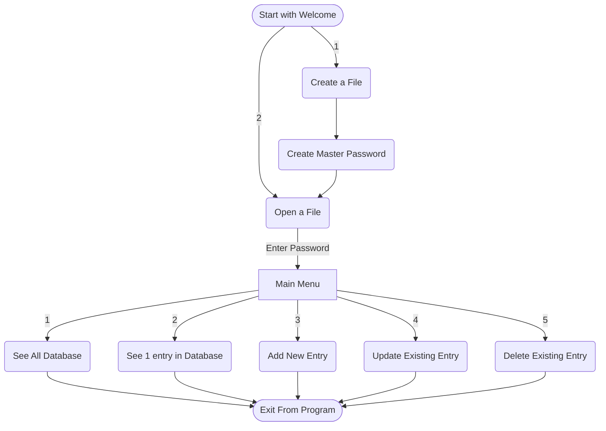

# CLI PASSWORD MANAGER IN PYTHON
#### Video demo: https://youtu.be/kyA6AvcbZJE
#### Description: Password Manager built-in python with .csv files password secured and salt encrypted

## Introduction

For my CS50 Python project, I have built a CLI Password Manager. It is a command-line interface tool built using Python, designed to help users securely store, manage and retrieve their passwords. By encrypting password data with salt and utilizing CSV files for data storage, it ensures both simplicity and security. Whether you're managing multiple accounts or just looking for a secure way to store your credentials, this tool is an efficient, portable, and easy-to-use solution for anyone who prefers a basic password manager.

## How It Works
A simple prompt system, whereby the user will have to enter the number for the option or action they want to perform within the program. It is built with 1 class and many while loops to keep the instance alive and going for every option available. I wrapped the main function in a try-except so as to avoid any error code appearing overall to keep it all clean. 

Please use the following flowchart to see the program path:

As shown in the chart above, all the options are available to manipulate the file as needed once open with the correct password. What the graph cannot show is that you can technically exit at any point in the program safely with Ctrl + C. It will check if any data is being manipulated/changed at the time or any file is open, confirm with the user to save it or not and do so safely. 

## Data Storage & Security

The password manager stores user data in CSV files, but to ensure security, all password information is **salted and encrypted** before being written to the file. The encryption is handled using the cryptography library, ensuring that even if the file is accessed by an unauthorized user, the password data remains secure. The salt used ensures that identical passwords stored in the CSV file will not have identical encrypted values.

There is no manipulation or checking of the data entered into the file by the user. It is the responsibility of the user to enter the correct information for their own data accounts.

**NOTE: IT IS THE RESPONSIBILTY OF THE USERS HOW THEY USE THE PROGRAM. IF DATA IS LOST, IT NOT THE RESPONSIBILITY OF THE PROGRAMMER.**

## Features:

- Secure and encrypted file manipulation
- Password random generator within every prompt for passwords
- Clean UI Design within terminal
- Easy creation of .csv files for account storage
- Portable
- Date/Time for creation and modification of the entries
- Easy use of the system with fail-safes for incorrect inputs or mistakes
- Check versus compromised lists for better check
- Strength check rating for every password entered 
- All files (main file for database + salt) are placed in a single folder (resources, created if not existing in directory)

# Data Stored per Entry:
+ Name
+ Email
+ Username
+ Password (whether manually entered or generated within program)
+ Notes
+ Creation Date/Time
+ Modification Date/Time

## Requirements.txt
* cffi==1.17.1

* cryptography==45.0.3

* iniconfig==2.1.0

* packaging==25.0

* pluggy==1.6.0

* pycparser==2.22

## Testing Dependant
* pytest==8.3.5

## Data Resources used

+ Compromised password list: https://www.ncsc.gov.uk/static-assets/documents/PwnedPasswordsTop100k.txt
+ StackOverflow
+ mermaid.js.org

## Failed Ideas or Future Improvements
- The first idea was to create a GUI interface (similar to KeePass and other Password Manager applications) with python built-in TkInter library. I was not aware how big or complicated it would get as a solo programmer, so I instead decided to go for a CLI programming interface. Allowed me to test better, understand the program on the basic level and what was required. I am glad I did not go with the GUI track, because even this one took me a few weeks to complete. 

- I initially wanted to create the files in a proper sqlite database for better security and portability of the files, but instead decided to simplify with csv and cryptography library for data encryption with password 

- Adding help features throughout the program.

- Removing data from the clipboard. Technically, any password that is copied can still be retreivable later. Wanted to add code whereby after a time interval, the clipboard will clear of what was copied from the program.

- Removing data from memory as a whole. I kept it simple, but wanted to add code whereby open exiting, all copied data from the file or through the program would be removed/cleared for extra security.

## Extra Information
+ Start Date: 26 May 2025
+ Completed Date: 07 June 2025
+ Version: 1.0.0
+ Status: Complete and reviewed

Thanks CS50P.